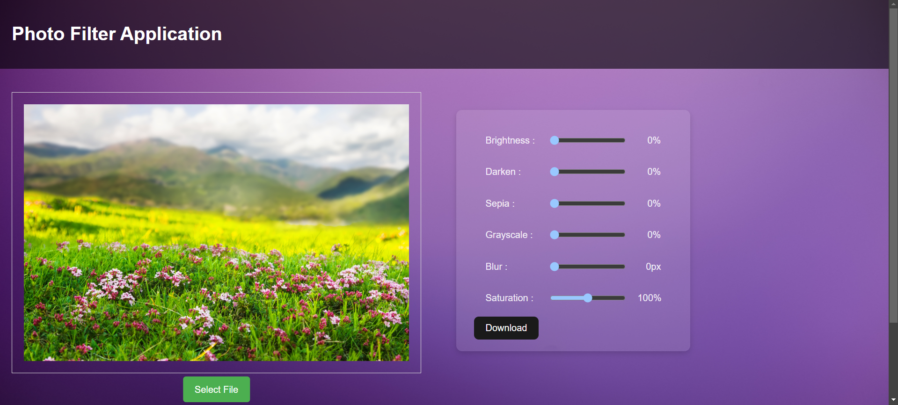
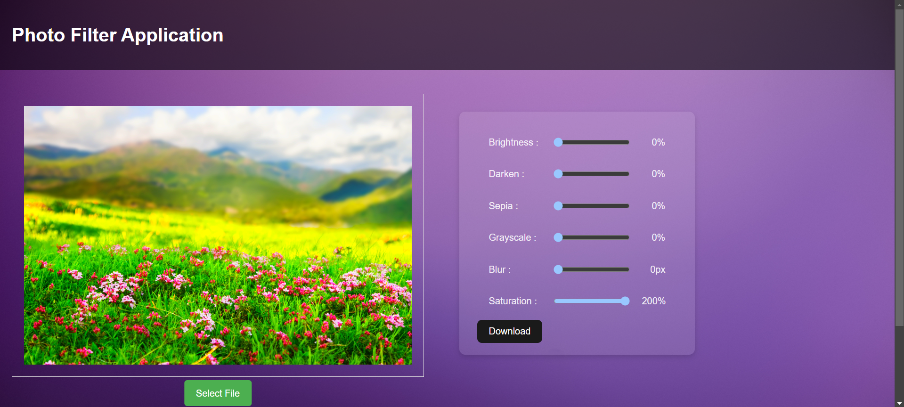
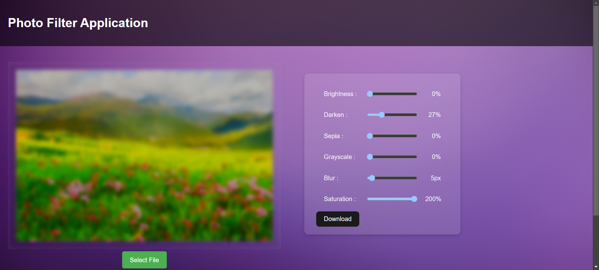
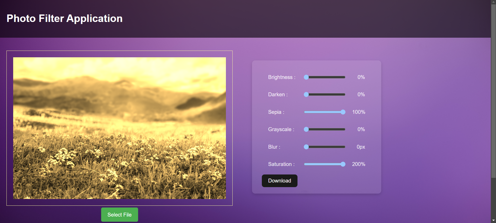

# Photo Filter App

This project is a photo filter application that allows users to upload images and apply real-time filters. The app provides an interactive interface for users to enhance their photos with various filter options.

## Demo

Check out the demo video of the Photo Filter App:
[Photo Filter App Demo Video](./assets/photo-filter-app.mp4)






## Technologies Used

- **Vite**: A fast development server and build tool, used for starting the project and getting quick feedback during the development process.
- **TypeScript**: Enabled static type checking for more secure and error-free code writing.
- **React**: Used for building the user interface of the application.
- **CSS**: Utilized for styling the application.
- **HTML**: Used for structuring the basic layout of the application.
- **React Hooks (useState, useEffect)**: Managed state and side effects inside React components.
- **JavaScript (ES6+)**: TypeScript is compiled into JavaScript for running the app.

## Features

- **Image Upload**: Users can upload their own images for editing.
- **Real-time Filters**: Various filters such as grayscale, sepia, and blur can be applied in real time.
- **Adjust Filter Intensity**: Users can control the intensity of the filters.
- **Image Preview**: Users can preview their filtered image before downloading.
- **Download Image**: Users can download the filtered image to their device.
da
## Setup Information

To get the project up and running locally, follow these steps:

1. **Clone the Project Repository**:
   ```bash
   git clone https://github.com/batux4n/photo-filter-app.git
   ```

2. **Navigate into the project directory**:
   ```bash
   cd photo-filter-app
   ```

3. **Install the dependencies**:
   ```bash
   npm install
   ```

4. **Start the development server**:
   ```bash
   npm run dev
   ```

## Contributing

Feel free to fork the repository and submit a pull request if you'd like to contribute to the project.

## License

This project is open-source and available under the [MIT License](LICENSE).
